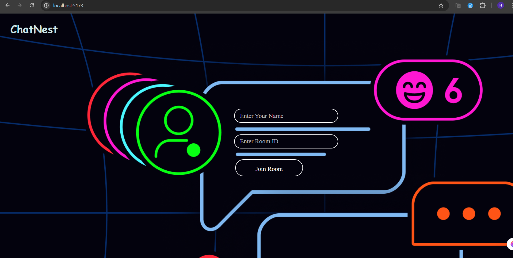

# ChatNest
ChatNest is a real-time messaging &amp; Code Sharing web application built using the MERN stack and Socket.IO. It enables users to create chat rooms, exchange text messages, and share code snippets and files (up to 2MB) seamlessly, just like popular messaging apps. A button for future collaborative code editing has also been included for upcoming features.

## Project ScreenShot


## Features
🔹 **Real-time individual and group chat** (up to 100 users)  
🔹 **Typing indicators** for active users  
🔹 **Upload and share code snippets** or text (simple paste like WhatsApp)  
🔹 **Upload and share files** (up to 2MB per file)  
🔹 **Create or join chat rooms** with unique Room IDs  
🔹 **Separate collaborative code editor window** (Coming Soon 🚀)

## Tech Stack
- **Frontend**: React.js (built with Vite)
- **Backend**: Node.js, Express.js
- **Real-Time Communication**: Socket.IO
- **Database**: MongoDB (using Mongoose)
- **File Uploads**: Multer
- **Session Management**: express-session

## Setup Instructions
1. Clone the repo (link coming soon).
2. Navigate to `/client` and run:

```bash
npm install
npm run dev
```
3. Navigate to /server and run:
 ```bash
npm install
npm run start
```
## Start chatting, uploading files, and sharing code snippets!

## Future Roadmap
✅ **Initial version** with real-time messaging and file sharing  
🔜 **Collaborative real-time code editor** (integrated with rooms)  
🔜 **Improved UI/UX enhancements**  
🔜 **Deployment** (Vercel/Render)

## 📌 Important
Built primarily for learning, showcasing, and portfolio demonstration purposes.  
Source code remains under active development and refinement.

## 📧 Contact
If you'd like to learn more, collaborate, or request access to the repository:  
Email: [2k22.cse.2213543@gmail.com]  
LinkedIn: [linkedin.com/in/h-a-r-s-h]

